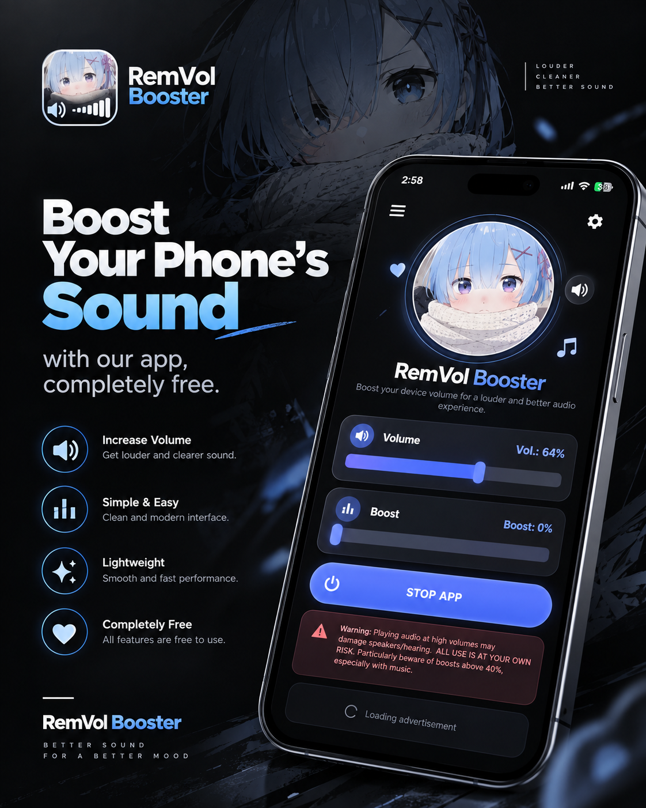

# RemVol Booster

> Boost your phone's sound with Rem.
> Completely free. Anime themed. Simple. Lightweight.

RemVol Booster is a completely free-to-use Android volume booster designed to make your phone's audio louder with a simple, lightweight interface.

Inspired by **Rem** from *Re:Zero*, the app combines an anime-themed design with a clean and easy-to-use volume control experience.

## Features

- **Volume Booster** — Increase your device's audio beyond the normal volume level.
- **Simple Interface** — Clean controls with easy-to-use volume and boost sliders.
- **Rem Anime Theme** — A dedicated Rem-inspired visual design.
- **Lightweight** — Built to stay simple without unnecessary features.
- **Completely Free** — No payment required to use the app's core features.
- **Easy Controls** — Start, adjust, and stop the booster directly from the main screen.
- **Safety Warning** — Includes warnings about potential speaker and hearing damage when using high boost levels.

## Design

RemVol Booster uses a soft blue, white, and lavender visual style inspired by Rem, combined with rounded cards, anime artwork, and minimal audio controls.

The goal is simple:

> Louder sound. Simple controls. Rem by your side.

## Important

Using excessive volume or audio amplification can damage your phone speakers or hearing. Use the booster responsibly and avoid unnecessarily high boost levels.

**Use at your own risk.**

## Free Forever

RemVol Booster is made to be a simple, accessible volume booster without requiring users to pay for basic functionality.

No complicated setup. Just open, boost, and listen.

## What's new in Version 1.2

- **Sponsor support** — once in a while the app shows a sponsor page; one tap closes it, and that's what keeps RemVol 100% free
- **Same feather-light app** — no new permissions, no bloat; sponsor settings update themselves silently in the background
- **Update notifications** — Version 1.1 users are told in-app that 1.2 is available

### What's new in Version 1.1

- **Settings fixed** — the settings screen no longer closes the app when opened; every option works smoothly now
- **Cleaner menu** — removed "Ad preferences"; Privacy policy is exactly where your privacy belongs
- **Update notifications** — the app now tells you when a new version is available on GitHub, straight from the menu

## Download

Grab the latest APK directly — no account needed:

**[⬇ Download RemVol Booster (free)](https://github.com/dhrubonai/remvol-booster/releases/latest/download/RemVol-booster.apk)**

Or browse all releases [here](https://github.com/dhrubonai/remvol-booster/releases).

> RemVol Booster — Boost your phone's sound with Rem.
> Completely free. Anime themed. Simple. Lightweight.

## Links

- 🌐 App website: <https://dhrubonai.github.io/remvol-booster/>
- 🔒 Privacy Policy: <https://dhrubonai.github.io/remvol-booster/privacy.html>
- 👤 Creator's portfolio: <https://dhrubox.com>
